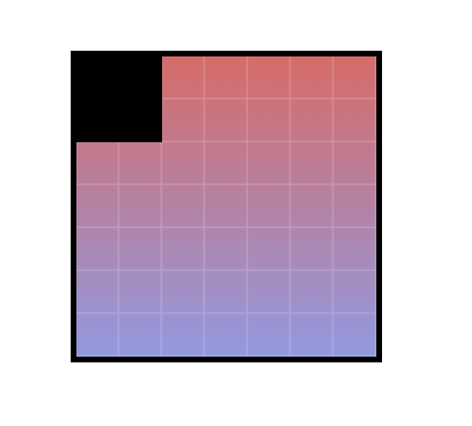

# Timed coding challenges

## What are timed coding challenges?

My mentor assigned me timed coding challenges 2x/week that challenged me to apply newly learned skills in different ways. After time was up, my mentor would review the work and we would talk through how I solved the challenge, what worked, where I struggled, and explore alternative solutions and the pros/cons of each. In some cases, I would be assigned incremental challenges to iterate on the work further.

## Why were they part of my learning path?

Beyond HTML/CSS learnings, the timed exercises were a forcing function to ruthlessly prioritize and learn to work faster, at a high-quality bar, to deliver a complete solution on the first attempt.

## What did I learn?

The timed element of the challenges was difficult at first. It required me to focus on how I approached development. I learned two important lessons that helped me become a better developer:

1. to focus on the core, structural elements first and work my way towards the details in order of priority.
2. to separate thinking from doing: it's more efficient to have a high-level plan before writing any code. For lower-level details, I learned to think about the next step while implementing the current one.

## Portfolio

Below are four coding challenges I'm proud of.

### Gradient Square

30 minutes – given image. This challenge required me to use CSS gradients, background positioning, and tiled background images.

### Layered Circles

30 minutes - given image. This challenge required me to layer circles of different sizes and position them around a common center point. Made use of relative positioning, transformations, and the z-index property.

### Progress bars

Series of progressive challenges in 15 minute increments - given HTML. The challenge provided limited HTML markup and required me to render progress bars using only CSS. Made heavy use of data attributes, pseudo elements, and CSS variables.

### Dashboard

2 hours - given image. This challenge was to build a full dashboard in a short period of time. This required me to prioritize my time by tackling the structural elements first then working towards the details.

